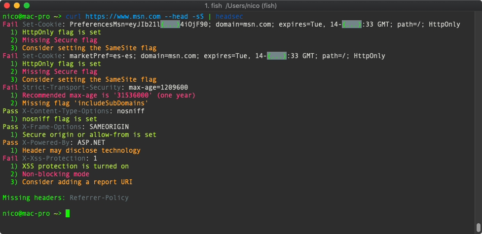

# headsec (beta)

Test a site's HTTP headers for possible security issues

**Basic usage**
```shell
$ headsec https://www.target.com
```

**Advances usage**

If you're trying to test an URL that requires authentication, a POST request, or anything
of the like, you can use `curl` and pipe the result to `headsec`
```shell
$ curl https://yahoo.com/ --head -sS | headsec
```

**Screenshot**



**Installation**

```shell
$ curl https://github.com/nicoSWD/headsec/releases/download/v0.1/headsec.phar -L -o /usr/local/bin/headsec
$ chmod u+x /usr/local/bin/headsec
```

**Build from source**

[composer](https://getcomposer.org) needs to be installed globally in order to build this

**Build**
```shell
$ make
```

**Test**
```shell
$ make test
```

**Install**
```shell
$ make install
```
