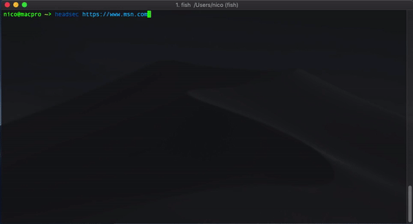

# headsec (&beta;)
[](https://travis-ci.org/nicoSWD/headsec)
[](https://scrutinizer-ci.com/g/nicoSWD/headsec/?branch=master)

Test a site's HTTP headers for possible security issues. This is a little like Scott Helme's [SecurityHeaders.com](https://securityheaders.com/),
but it can be run locally on your machine or CI



**Basic usage**

This will analise the headers returned by the supplied URL and print the results. By default, non-security headers
are omitted in the output, but can be printed as well by passing the `--show-all-headers` flag (or `-a`)
```shell
$ headsec google.com
```

By default it'll follow redirects and only print the results of the last URL. To stop following redirects, pass
the `--ignore-redirects` flag (or `-r`)
```shell
$ headsec google.com --ignore-redirects
```

**Advanced usage**

If you're trying to test an URL that requires authentication, a POST request, or anything
of the like, you can use `curl` and pipe the result to `headsec`
```shell
$ curl https://yahoo.com/ --head -sS | headsec
```

**Installation**

```shell
$ curl https://raw.githubusercontent.com/nicoSWD/headsec/master/install.sh -sS | sh
```

**Build from source**

**Build**
```shell
$ make
```

**Test**
```shell
$ make test
```

**Install**
```shell
$ make install
```
